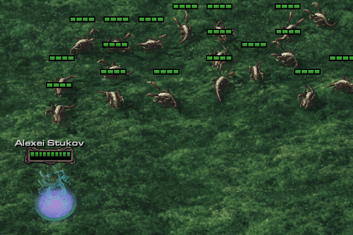
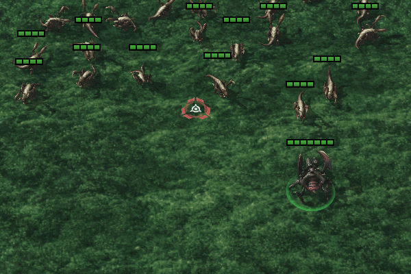

# Starcraft 2 custom datasapace assets

Tutorial on how to make use of data spaces: https://s2editor-guides.readthedocs.io/New_Tutorials/04_Data_Editor/data-spaces/

# Abilities
||Ability: Frost Nova|
|-------------| ------------- |
|||
|Source: |wip project|
|Asset Type:| Ability, hero ability|
|Description:| After a preparation time of 6 seconds releases a powerful frost nova that damages and freezes nearby enemies.|
|Editor Level:| Basic|
|Data Tags:| Glazes, actor spam|
|Editor Notes:| Uses following imported Hots Assets: Storm_Effect_Arthas_Base_HowlingBlast_Impact.m3, Storm_FX_Jaina_Base_FrigidTransmission_In.m3, Storm_FX_Jaina_Base_RingofFrost_Small.m3, Storm_FX_KelThuzad_Base_FrostBlast_Impact.m3 |
|Dataspace Link:| https://mega.nz/file/y0FTmZYI#TkGmIKKwE4uxc2aKD-N4R2HuIlte5VbPBdEPctlveR8|
|Testmap Link:| https://mega.nz/file/j0tg1QpQ#VjNZ4Y5zgVpoYiJuqpv3945-gqLtg8YEOnTxbqu6XpA|
---
||Ability: Storm Spiral|
|-------------| ------------- |
|||
|Source: |unreleased project|
|Asset Type:| Ability, creep ability|
|Description:| Summons two beams of energy that will spiral outward damaging enemies they hit. Can damage same enemy once every second.|
|Editor Level:| Moderate|
|Data Tags:| Dummy units, kinetics|
|Editor Notes:| Creates units with offset, then applies kinetics for rotation and force effects to push units outwards. There are 3 sets of kinetics for different rotation speeds. Faster starting kinetics are replaced with slower kinetics so that ability could be dodged as it expands. By default ability creates 2 beams, but it can be easily adjusted for more, with some trigger help to create offsets. Trigger example is included in testmap.|
|Dataspace Link:| https://mega.nz/file/C1cFyJSI#xCFvHEwd2QiNPF_huQyw4DY1FI1VVkggFkyxnqanZBg|
|Testmap Link:| https://mega.nz/file/mlUHETDL#r5YTIo2LVieyiWqbcJTMwznBvnlYKgOzm5cNGRjdRRI|
---

||Ability: Ribcage|
|-------------| ------------- |
|||
|Source: |Crash RPG Maximum (unreleased patch)|
|Asset Type:| Ability, creep ability|
|Description:| Manifests lurker spines in target direction that will after a short delay close down shredding everything trapped between them.|
|Editor Level:| Moderate|
|Data Tags:| Dummy units|
|Editor Notes:| Creates units with offset, then orders created units to use their custom move ability to move towards offset location.|
|Dataspace Link:| https://mega.nz/file/btNnEKZI#AN04M9zzgk5GH1G-4mJ3rAYiu03IXEm5HD14Md3F0A8|
|Testmap Link:| https://mega.nz/file/vxsXBbwR#Rdq--DT5agxoOAHFEZ8V0TvEo9Z51lcaAMCrEsZ6JA0|
---

# Units
||Unit: Flame Wraith|
|-------------| ------------- |
|||
|Source: |wip project|
|Asset Type:| Unit, creep unit|
|Description:| An evil spirit that will rotate around it's target, burning it with infernal fire. There are 2 unit varians - active and hidden. Hidden is invulnerable and "hidden", will reveal self (and use evil laugh sound) when it has a valid target. Has custom death outro where it negates fatal damage, creates explosions over self, then after a delay truly dies. Inspired by castlevania's skulls + certain enemies in NES super contra stage 6.|
|Editor Level:| Moderate|
|Data Tags:| Kinetics.|
|Editor Notes:| Uses kinetics + force effect to make unit rotate around it's target, getting pulled in if target is away and pushed away if target is close. Uses edited HotS assets Storm_Effect_KingsCrest_GhostShip_Missile.m3 (some effects removed) and Merc_BlackKnight_Vox_Idle_Laugh01.wav. Icon + Wireframe included. |
|Dataspace Link:| https://mega.nz/file/v5lFmQKZ#GgtH3XGw0YyvCgFhJnAq8RKIxa0SsyWZ2Sx1JvS0xRQ|
|Testmap Link:| https://mega.nz/file/m5kF2BhL#SFV7T07ScgkcOQYMxuXMzg-2uUZ9eUCQoW25Z64DPr4|

---
||Unit: Abyssal|
|-------------| ------------- |
|||
|Source: |wip project|
|Asset Type:| Unit, creep unit|
|Description:| Hybrid that is imbued with an invisible shard (another unit). While shard is alive - it'll provide hybrid with life regeneration. Shard is designed to be killed when detected or by being caught in AOE.|
|Editor Level:| Moderate - Easy|
|Data Tags:| Dummy units, kinetics.|
|Editor Notes:| Shard uses cloak + burrow to be completely invisible while undetected. It is attached to hybrid via kinetics.|
|Dataspace Link:| https://mega.nz/file/zkFBBaLQ#noIfArplKKcAkYHj-YL_-LebIjqLRisbJBNzM9Xkiys|
|Testmap Link:| https://mega.nz/file/jw8QhSrD#fnnVw4Qvkbq75qkgiozpyFaYzAuoNF8d7x-LmynT5Gg|
---
||Unit: Arc Mage|
|-------------| ------------- |
|||
|Source: |wip project|
|Asset Type:| Unit, creep unit|
|Description:| A mage that fires a laser like attack that consists of 10 missiles fired 1 by 1.|
|Editor Level:| Basic |
|Data Tags:|Collideable projectiles.|
|Editor Notes:|Spell's animations are controlled by a "simple" actor type for automatic animation when used by any other unit with the same model type.|
|Dataspace Link:| https://mega.nz/file/ygdhBTAJ#l0sconIh5Ug9guD0NNvjobDxk68KuU1cO4PWj3JYfx8|
|Testmap Link:| https://mega.nz/file/Dk8SiCbb#_zkv_DnQqb0Leq7DrNM2n5sQ065kSfQ4rFxHVcprulo|
---
||Unit: Alien Roach|
|-------------| ------------- |
|||
|Source: |Crash RPG Maximum|
|Asset Type:| Unit + ability, creep unit|
|Description:| Roach that will use whirlwind ability on it's 5th normal attack. Whirlwind gains 1 damage each time it hits an enemy. In original map triggers are used to extend whirlwind duration by 1 sec. on hit.|
|Editor Level:| Basic|
|Data Tags:| SOp Rotator.|
|Editor Notes:| LotV whirlwind zealot used as a base.|
|Dataspace Link:| https://mega.nz/file/v1E3HaYQ#exNfrDAe5mo1SNzJR5xGXnc1XG0pqAdNfGtkIBwf66o|
|Testmap Link:| https://mega.nz/file/v4FhiCJK#ZBJRz8MhnB0MYHLIi2eaGrQO0VvXWcSJBRap0sf9PDA|
---
||Unit: Void Sliver|
|-------------| ------------- |
|||
|Source: |QRPG1 Renegade|
|Asset Type:| Unit + ability, creep unit|
|Description:| Void sliver that will stun single enemy with it's autoattack up to (Can stun up to 3 enemies at the same time).|
|Editor Level:| Basic|
|Data Tags:|-|
|Editor Notes:| Void Sliver from coop used as a base.|
|Dataspace Link:| https://mega.nz/file/Gs910AjL#rOOTrx8tRtPxdzlDSkeD001N8hQ4elPMAIJB_6_XX1M|
|Testmap Link:| https://mega.nz/file/nlNxzCCL#9APffQWe0RPZklknD6734bXZqGmFQmv2jyTFskN_apQ1M|

