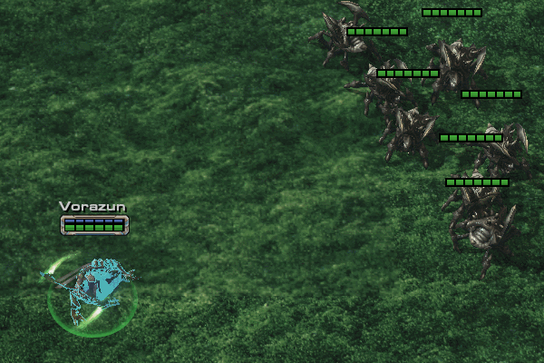

# Starcraft 2 custom datasapace assets

I want someplace to store/share assets I make/reuse, but since I've only had small experience with github, it's the only thing I know for now, so I'm doing it this way :D

If anyone wants to use these assets or add their own to the list - feel free to do so.

# Abilities

||Ability: Storm Spiral|
|-------------| ------------- |
|||
|Source: |Spec Ops: Raid (by duckies, unreleased)|
|Asset Type:| Ability, creep ability|
|Description:| Summons two beams of energy that will spiral outward damaging enemies they hit. Can damage same enemy once every second.|
|Editor Level:| moderate|
|Data Tags:| dummy units, kinetics|
|Editor Notes:| Creates units with offset, then applies kinetics for rotation and force effects to push units outwards. There are 3 sets of kinetics for different rotation speeds. Faster starting kinetics are replaced with slower kinetics so that ability could be dodged as it expands. By default ability creates 2 beams, but it can be easily adjusted for more, with some trigger help to create offsets. Trigger example is included in testmap.|
|Dataspace Link:| https://mega.nz/file/C1cFyJSI#xCFvHEwd2QiNPF_huQyw4DY1FI1VVkggFkyxnqanZBg|
|Testmap Link:| https://mega.nz/file/mlUHETDL#r5YTIo2LVieyiWqbcJTMwznBvnlYKgOzm5cNGRjdRRI|
---

||Ability: Ribcage|
|-------------| ------------- |
|||
|Source: |Crash RPG Maximum (by duckies)|
|Asset Type:| Ability, creep ability|
|Description:| Manifests lurker spines in target direction that will after a short delay close down shredding everything trapped between them.|
|Editor Level:| moderate|
|Data Tags:| dummy units|
|Editor Notes:| Creates units with offset, then orders created units to use their custom move ability to move towards offset location.|
|Dataspace Link:| https://mega.nz/file/btNnEKZI#AN04M9zzgk5GH1G-4mJ3rAYiu03IXEm5HD14Md3F0A8|
|Testmap Link:| https://mega.nz/file/vxsXBbwR#Rdq--DT5agxoOAHFEZ8V0TvEo9Z51lcaAMCrEsZ6JA0|
---

# Units
---
||Unit: Alien Roach|
|-------------| ------------- |
|||
|Source: |Crash RPG Maximum (by duckies)|
|Asset Type:| Unit + ability, creep unit|
|Description:| Roach that will use whirlwind ability on it's 5th normal attack. Whirlwind gains 1 damage each time it hits an enemy. In original map triggers are used to extend whirlwind duration by 1 sec. on hit.|
|Editor Level:| Basic|
|Data Tags:| SOp Rotator.|
|Editor Notes:| LotV whirlwind zealot used as a base.|
|Dataspace Link:| https://mega.nz/file/v1E3HaYQ#exNfrDAe5mo1SNzJR5xGXnc1XG0pqAdNfGtkIBwf66o|
|Testmap Link:| https://mega.nz/file/v4FhiCJK#ZBJRz8MhnB0MYHLIi2eaGrQO0VvXWcSJBRap0sf9PDA|
---
||Unit: Void Sliver|
|-------------| ------------- |
|||
|Source: |QRPG1 Renegade (by duckies)|
|Asset Type:| Unit + ability, creep unit|
|Description:| Void sliver that will stun single enemy with it's autoattack up to (Can stun up to 3 enemies at the same time).|
|Editor Level:| Basic|
|Data Tags:| -|
|Editor Notes:| Void Sliver from coop used as a base.|
|Dataspace Link:| https://mega.nz/file/Gs910AjL#rOOTrx8tRtPxdzlDSkeD001N8hQ4elPMAIJB_6_XX1M|
|Testmap Link:| https://mega.nz/file/nlNxzCCL#9APffQWe0RPZklknD6734bXZqGmFQmv2jyTFskN_apQ1M|

